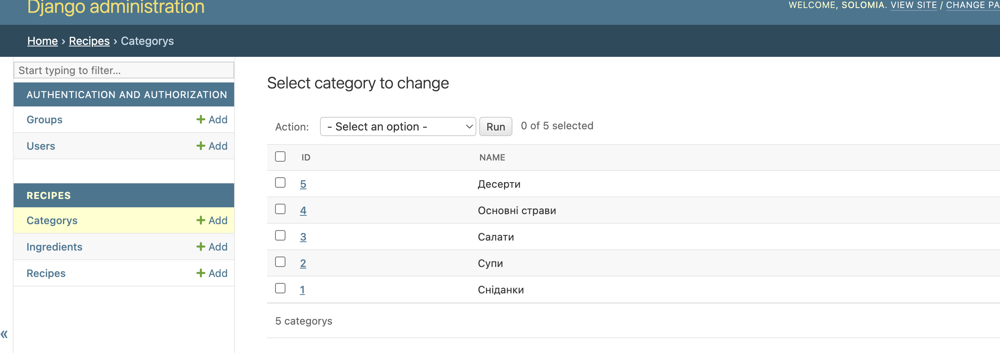
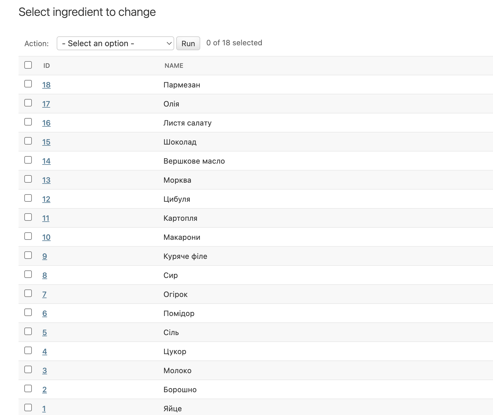
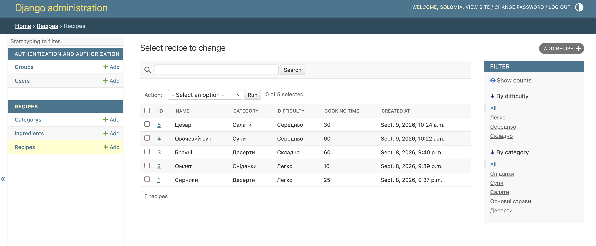

# Recipe App

Django-застосунок для зберігання та організації рецептів.

## Моделі

- Category — категорія рецепта
- Recipe — рецепт
- Ingredient — інгредієнт

Recipe має ForeignKey на Category
та ManyToMany зв'язок з Ingredient.

## Налаштування бази даних і запуск

1. **Створити та активувати віртуальне середовище:**

```bash
python3 -m venv venv
source venv/bin/activate
```

2. **Встановити залежності:**

```bash
pip install django
```

3. **Застосувати міграції:**

```bash
python3 manage.py migrate
```

4. **Створити суперкористувача для адмін-панелі:**

```bash
python3 manage.py createsuperuser
```

5. **Запустити локальний сервер:**

```bash
python3 manage.py runserver
```

Застосунок доступний за адресою `http://127.0.0.1:8000/`, а адмін-панель — `http://127.0.0.1:8000/admin/`.

## Скріншоти адмінки

### Категорія рецептів


### Інгредієнти


### Повний список рецептів
